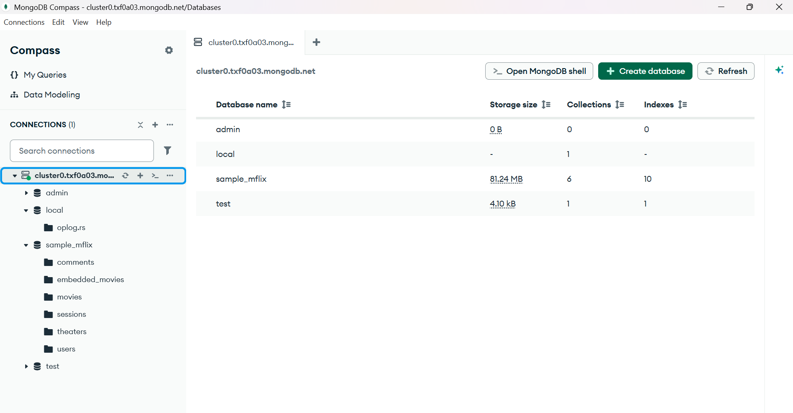
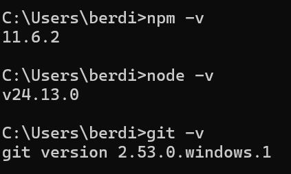

# 🚀 Task 1: Setup Development Environment

## Level 1 (Basic)

This task focuses on setting up a full-stack development environment
using essential development tools.

------------------------------------------------------------------------

## 🎯 Objectives

-   Install and configure Node.js and npm/yarn
-   Set up a GitHub repository
-   Install a database (MongoDB / MySQL / PostgreSQL)
-   Learn basic terminal commands

------------------------------------------------------------------------

## 🛠️ Tools

-   Node.js
-   npm / yarn
-   VS Code
-   Git & GitHub
-   MongoDB
-   Terminal

------------------------------------------------------------------------

## ✅ Step 1 --- Install Node.js

Download Node.js:

https://nodejs.org

Check installation:

node -v\
npm -v

Install yarn (optional):

npm install -g yarn

Check yarn:

yarn -v

------------------------------------------------------------------------

## ✅ Step 2 --- Install VS Code

Download:

https://code.visualstudio.com

Recommended Extensions:

-   Prettier
-   ESLint
-   GitLens
-   ES7+ React Snippets

------------------------------------------------------------------------

## ✅ Step 3 --- Setup Git & GitHub

Install Git:

https://git-scm.com

Check version:

git --version

Configure Git:

git config --global user.name "Your Name"\
git config --global user.email "your@email.com"

Initialize repository:

git init\
git add .\
git commit -m "Initial commit"

Connect to GitHub:

git remote add origin `<repository-link>`{=html}\
git push -u origin main

------------------------------------------------------------------------

## ✅ Step 4 --- Install MongoDB

Download MongoDB Community Edition:

https://www.mongodb.com/try/download/community

Check installation:

mongod --version

### 📸 MongoDB Setup Screenshot

------------------------------------------------------------------------

## ✅ Step 5 --- Basic Terminal Commands

  Command   Description
  --------- ------------------------
  pwd       Show current directory
  ls        List files
  cd        Change directory
  mkdir     Create folder
  touch     Create file
  clear     Clear terminal
  rm        Remove file

### 📸 Terminal Setup Screenshot

------------------------------------------------------------------------

## 📂 Project Structure

CODVEDA-INTERNSHIP/ │ ├── Level-1_public/ │ ├── mongodb.png │ └──
terminal-setup.png │ └── README.md

------------------------------------------------------------------------

## 🎉 Result

Development environment is successfully configured and ready for future
tasks.

------------------------------------------------------------------------

## 👨‍💻 Author

Sarvarbek Berdiyev
